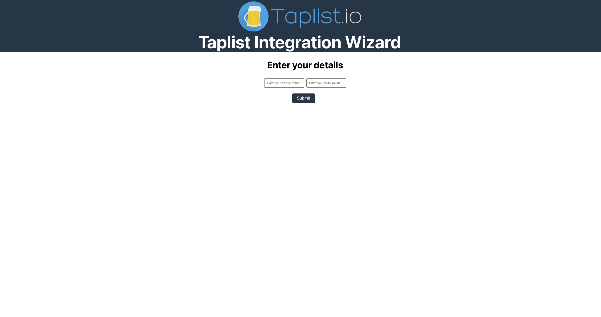

# Taplist Integration Wizard

### Manage your Taplist keg levels through a simple interface

## Instructions

### A paid subscription to taplist.io is required

Log into your taplist.io account and select 'Account' in the navigation bar and then 'Integrations'. Create and API key and copy it.

Run the Taplist Integration Wizard and enter your venue name and the API Key.

